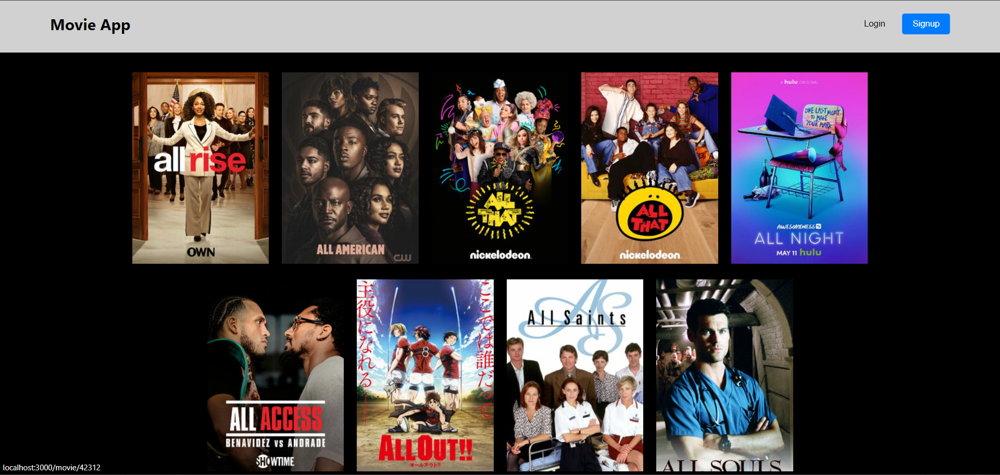

# Movie Booking App
This is a simple ReactJS application for browsing movie details.

## Features
Display movie details

## Getting Started
Follow these instructions to get the project up and running on your local machine.

## Prerequisites
Node.js installed on your machine

npm or yarn package manager

Installation

## Clone the repository:

bash

Copy code

git clone https://github.com/harshKumar029/movies.git

Navigate to the project directory:

bash

Copy code   

cd movie

## Install dependencies:

bash

Copy code

npm install

# or

yarn install

Usage

Start the development server:

bash

Copy code

npm start

Open your browser and navigate to http://localhost:3000 to view the application.
